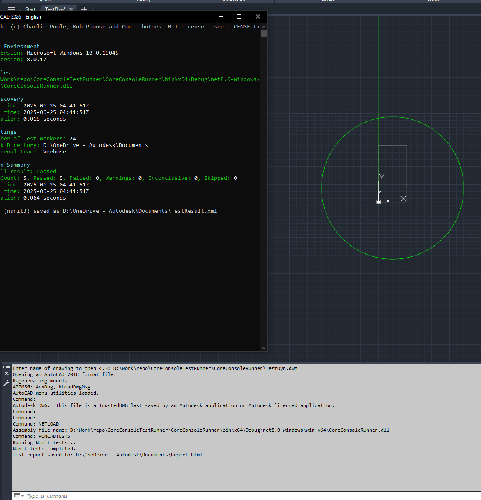
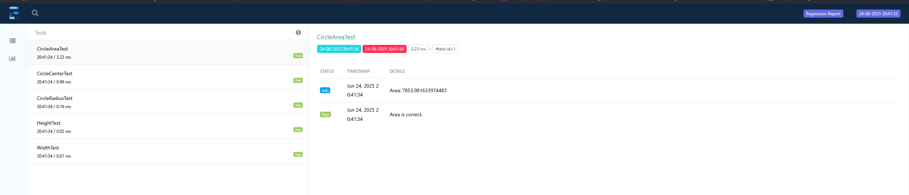
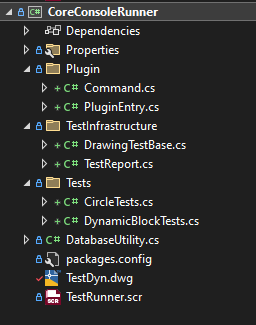

# Unit Testing AutoCAD with NUnit + AcCoreConsole

This project demonstrates how to write and execute automated **unit tests for AutoCAD drawings** using:

- [`NUnit`](https://nunit.org/)

- `accoreconsole.exe` — AutoCAD’s headless scripting engine

- AutoCAD .NET API

- AutoCAD 2026 (latest as of this writing — works for older and future releases too)

### 📦 NuGet Packages Used

This project uses the following NuGet packages:

| Package            | Version | Description                                                            |
| ------------------ | ------- | ---------------------------------------------------------------------- |
| `NUnit`            | 4.3.2   | Latest NUnit framework for writing test cases.                         |
| `NUnitLite`        | 4.3.2   | Embedded lightweight runner to execute tests via AutoCAD Core Console. |
| `ExtentReports`    | 5.0.4   | Beautiful HTML test report generator integrated with the tests.        |
| `AutoCAD.NET.Core` | 25.1.0  | AutoCAD 2026 .NET API package for custom development and testing.      |

> ✅ **Note**: `NUnitLite` is used to self-host and run the tests from inside `accoreconsole.exe`, making the solution CI/CD friendly without needing an external test runner.

---

## 🔧 Project Setup

### 1. Prerequisites

- **AutoCAD 2026 installed**

- [.NET 8 SDK](https://dotnet.microsoft.com/download/dotnet/8.0)

- Visual Studio 2022+ with desktop development workload

- Access to required AutoCAD .NET reference assemblies (`acdbmgd.dll`, `acmgd.dll` etc.)

---

### 2. Clone and Build

Before building, make sure AutoCAD assemblies are referenced correctly in the `.csproj`.

```bash
git clone https://github.com/MadhukarMoogala/coreconsolerunner.git
cd coreconsolerunner
msbuild /t:build coreconsolerunner.sln
```

## ✅ Running Tests

This project allows running NUnit-based unit tests against DWG files in **three different ways**:

### ✅ Summary of Logic Flow:

| Case                                  | Logic                                           |
| ------------------------------------- | ----------------------------------------------- |
| **1. Core Console**                   | Use `/i` argument passed via command line       |
| **2. AutoCAD GUI, file open**         | Use active document path if available and saved |
| **3. AutoCAD GUI, no doc or unsaved** | Prompt user to select a `.dwg` file for testing |

### 🟦 Case 1 – **AutoCAD Core Console (accoreconsole.exe)**

Best for CI pipelines and automation.

#### **Steps**:

1. Ensure your DWG test file path is passed using the `/i` switch.

2. Run the `accoreconsole` with a script file that `NETLOAD`s your DLL and runs the `RunCADtests` command.

#### Example:

```batch
accoreconsole.exe /i "D:\Tests\testdrawing.dwg" /s "TestRun.scr"
```

`TestRun.scr` contents:

```bash
NETLOAD
D:\Path\To\Your\TestAssembly.dll
RunCADtests
QUIT
Y
```

### 🟦 Case 2 – **AutoCAD GUI (Named Drawing)**

Run tests on the currently opened DWG file in the AutoCAD GUI.

#### **Steps**:

1. Open your DWG file in AutoCAD.

2. Load your test DLL using `NETLOAD`.

3. Run the command:

```bash
Command: RunCADtests
```

## 🟦 Case 3 – **AutoCAD GUI (Prompt User for File)**

If no document is open, AutoCAD will prompt the user to select a `.dwg` file for testing.

#### **Steps**:

1. Start AutoCAD.

2. `NETLOAD` your DLL.

3. Run the command:
   
   1. `Command: RunCADtests`

4. A file dialog will appear asking for a DWG file.

5. After selection, tests will be run against that file in an **off-screen** side database.

## 

## 📄 Sample Output

- Running in `accoreconsole.exe` with `RunTests.bat`

```log
RunTests.bat
Current dir is now: D:\Work\repo\CoreConsoleTestRunner
Using accoreconsole at: D:\ACAD\watt\AutoCAD 2026\accoreconsole.exe
Running in AutoCAD mode...
Redirect stdout (file: C:\Users\moogalm\AppData\Local\Temp\accc315322).
AcCoreConsole: StdOutConsoleMode: processed-output: enabled,auto
AutoCAD Core Engine Console - Copyright 2025 Autodesk, Inc.  All rights reserved. (W.74.0.0)

Execution Path:
D:\ACAD\watt\AutoCAD 2026\accoreconsole.exe
Current Directory: D:\Work\repo\CoreConsoleTestRunner

Version Number: W.74.0.0 (UNICODE)
LogFilePath has been set to the working folder.
Regenerating model.
Drawing created using acadiso.dwt from AutoCAD profile: <<Unnamed Profile>>
**** System Variable Changed ****
1 of the monitored system variables has changed from the preferred value. Use SYSVARMONITOR command to view changes.


AutoCAD menu utilities loaded.
Command:
Command:

Command:
Command: SECURELOAD

Enter new value for SECURELOAD <0>: 0

Command: netload Assembly file name: "D:\Work\repo\CoreConsoleTestRunner\CoreConsoleRunner\bin\x64\Debug\net8.0-windows\win-x64\CoreConsoleRunner.dll"

Command: RunCADtests

Running NUnit tests...

Invalid or missing drawing path:
Command: QUIT
_Y
Really want to discard all changes to drawing? <N> _Y

Command:
QUIT

LogFilePath has been restored to ''.
Exit Code: 0
```

- Running from AutoCAD GUI



## Test Reports

- XML results saved to:  
  `TestResult.xml`

- Optional: Generate **HTML reports** using:
  
  - [ExtentReports](https://extentreports.com/)
    
    

---

## Project Structure

 

---

## 

### Adding New Tests

To add a new AutoCAD entity test, create a class under the `Tests/` folder using the same pattern as existing ones. Each test class must:

- Inherit from `DrawingTestBase`

- Be decorated with `[TestFixture, Apartment(ApartmentState.STA), Category("EntityName")]`

🆕 Example: `LineTests`

```csharp
[TestFixture, Apartment(ApartmentState.STA), Category("Line")]
public class LineTests : DrawingTestBase
{
    private Line _line;

    public void GetFirstLine()
    {
        if (_line != null) return;

        var modelSpace = (BlockTableRecord)trans.GetObject(
            SymbolUtilityServices.GetBlockModelSpaceId(testDb),
            OpenMode.ForRead);

        foreach (ObjectId entId in modelSpace)
        {
            if (entId.ObjectClass.Name == "AcDbLine")
            {
                _line = trans.GetObject(entId, OpenMode.ForRead) as Line;
                break;
            }
        }

        if (_line == null)
            Assert.Fail("No line entity found in ModelSpace.");
    }

    [Test]
    public void LineLengthTest()
    {
        GetFirstLine();
        var test = TestReport.Extent.CreateTest(nameof(LineLengthTest));
        Assert.That(_line.Length, Is.EqualTo(100).Within(0.001));
        test.Pass($"Length: {_line.Length}");
    }

    [Test]
    public void LineStartPointTest()
    {
        GetFirstLine();
        var test = TestReport.Extent.CreateTest(nameof(LineStartPointTest));
        Assert.That(_line.StartPoint, Is.EqualTo(new Point3d(0, 0, 0)).Using<Point3d>((a, b) => a.IsEqualTo(b, new Tolerance(1e-6, 1e-6)) ? 0 : 1));
        test.Pass($"Start Point: {_line.StartPoint}");
    }
}
```

## 💡 Notes

- `accoreconsole.exe` is headless: ideal for CI/CD pipelines and regression testing.

- Ensure that `SECURELOAD` is set to `0` in script to allow `.dll` loading.

- Tests can inspect entities (e.g. `Circle`, `BlockReference`) using AutoCAD API.

### 🙏 Special Thanks

This project is inspired by:

- [**CADbloke/CADtest**](https://github.com/CADbloke/CADtest)  
  *CADtest runs NUnitLite version 3 inside AutoCAD and/or the AutoCAD Core Console.*

Highly recommended resource for plugin-level unit testing:

- **AutoCAD/Civil 3D Plugin Unit Test with NUnit – Civil WHIZ**  
  *A helpful guide on structuring NUnit-based tests in the context of AutoCAD and Civil 3D.*](https://civilwhiz.com/docs/autocad-civil-3d-plugin-unit-test-with-nunit/)

### ✍️ Written By

**Madhukar Moogala**  
*Developer Advocate*